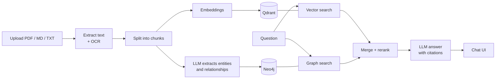
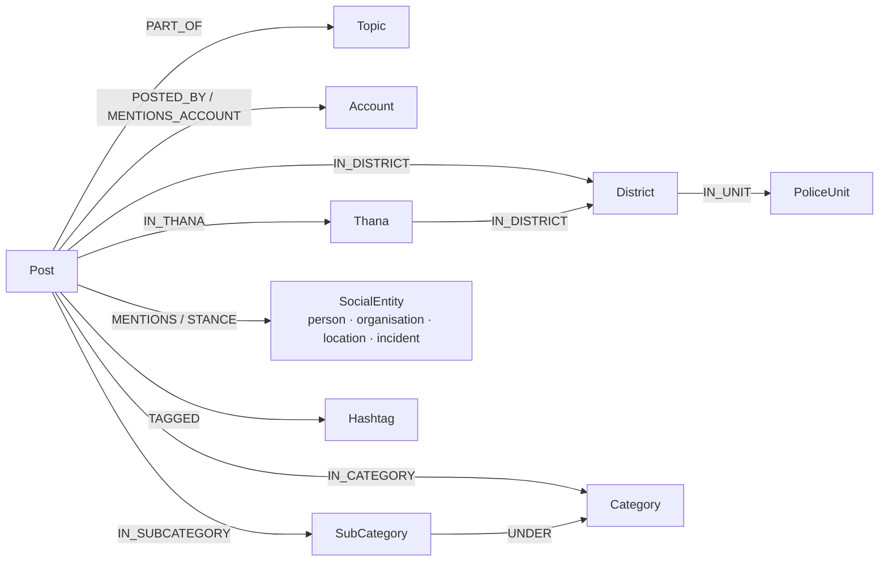

# Hybrid GraphRAG — Qdrant + Neo4j

Ask questions about your documents and get answers **with citations**.
Each document is stored two ways — as **vectors in Qdrant** (for semantic search) and as a **knowledge graph in
Neo4j** (people, companies, places and how they are connected). Every question searches both, and an LLM writes the
answer from the combined evidence.

- **Documents:** PDF (including scanned pages and text in images, via OCR), Markdown, text — in **any language**
  (tested with English, Hindi, Hinglish)
- **Answers** cite text excerpts as `[C1]` and graph facts as `[G1]`; answers come in the question's language
- **Hybrid beats either alone** on multi-step questions ("Who leads the company whose supplier was put on
  probation?"), counting ("Which vendor supplies the most subsidiaries?") and cross-language questions
- **Chat over SQL data:** load a MySQL dump of monitored social-media posts and ask about it in Hindi or English —
  semantic search in Qdrant, relationships and **exact counts** ("top 5 districts by negative CRIME posts") from
  Neo4j. See [Chat over SQL data](#chat-over-sql-data-social-media-posts)
- **LLM of your choice:** OpenAI, Google Gemini, or a free local model with Ollama — switchable in the UI
- Runs entirely in **Docker**: Qdrant, Neo4j, a FastAPI backend and a Streamlit chat UI

**📹 [Watch the demo video](https://drive.google.com/file/d/1pOXXcfG1gwwSWge_hQsNTBh6YWCwmKJn/view?usp=sharing)** to see it in action.

---

## How it works



```
Upload ─► text + OCR ─► chunks ─┬─► embeddings ─────────► Qdrant  (vectors)
                                └─► LLM: entities + links ─► Neo4j  (graph)

Question ─┬─► vector search (Qdrant) ─┐
          └─► graph search  (Neo4j)  ─┴─► merge + rerank ─► LLM ─► answer with [C#] / [G#] citations
```

Vector search finds text that *looks like* the question. The graph follows *connections* — across documents and
languages — that plain similarity search can't. Using both gives the best answers (see [Results](#results)).

---

## Run it locally

### 1. Install

- **Docker** with Docker Compose — [Docker Desktop](https://www.docker.com/products/docker-desktop/) on Windows /
  macOS (Windows: use the WSL 2 backend), or Docker Engine on Linux. Give Docker **at least 8 GB of RAM**.
- **git**. `make` is optional — every command below also has a plain `docker compose` version.
- About **8 GB of free disk space**.

### 2. Clone and configure

```bash
git clone https://github.com/thepratyushranjan/hybrid-graphrag.git
cd hybrid-graphrag
cp .env.example .env          # Windows PowerShell: copy .env.example .env
```

Open `.env` and set two things:

1. **`NEO4J_PASSWORD`** — any password with 8+ characters (set it before the first start).
2. **An LLM** — pick one:

| Option | Put this in `.env` | Notes |
|---|---|---|
| **OpenAI** (default) | `LLM_PROVIDER=openai`<br/>`LLM_MODEL=gpt-4o-mini`<br/>`OPENAI_API_KEY=sk-...` | Simplest; small API cost |
| **Ollama** (free, local) | `LLM_PROVIDER=ollama`<br/>`LLM_MODEL=gemma4:latest`<br/>`LLM_REASONING_EFFORT=none`<br/>`ANSWER_REASONING_EFFORT=low`<br/>`EXTRACTION_REASONING_EFFORT=low` | Install [Ollama](https://ollama.com), run `ollama pull gemma4`. Needs a GPU with ~8 GB+ VRAM. Data never leaves your machine |
| **Gemini** | `LLM_PROVIDER=gemini`<br/>`LLM_MODEL=gemini-2.5-flash`<br/>`GEMINI_API_KEY=...` | Free tier available |

Everything else in `.env` already has working defaults. The SQL chat needs **no extra credentials**: it uses the
same Qdrant, Neo4j and LLM settings (its own options are in the `SQL corpus` block of `.env.example`).

> **Using Ollama?** It runs models with a 4096-token context by default and silently cuts longer prompts. For
> long Hindi evidence, start Ollama with more context: `OLLAMA_CONTEXT_LENGTH=8192 ollama serve` (or set it in the
> Ollama service environment).

### 3. Start

```bash
docker compose up -d
```

The first start builds the image and downloads ~2 GB (PyTorch, the embedding and reranker models, OCR) — this takes
several minutes once; later starts take seconds. Check that everything is up:

```bash
curl http://localhost:8000/health
# ... "checks": {"qdrant": "ok", "neo4j": "ok", "llm": "ok"}
```

### 4. Load the sample documents (optional)

```bash
make seed                     # or: docker compose exec api python scripts/seed.py
```

This loads the two sample documents from `data/samples/` (a few minutes with a local model). You can skip it and
upload your own files from the UI instead.

### 5. Load the SQL data (optional)

The dump is **not in the repo** (it holds real monitoring data). Copy it in, then load it:

```bash
mkdir -p data/sql && cp /path/to/sample_latest_100_data.sql data/sql/
make ingest-sql               # or: docker compose exec api python scripts/ingest_sql.py
```

10,000 posts take about 9–10 minutes on CPU (mostly embedding). For a quick try, set `SQL_INGEST_LIMIT=2000` in
`.env` first. You can also load it from the UI sidebar (**Load SQL dump**).

### 6. Open the app

| | URL |
|---|---|
| **Chat UI** | http://localhost:8501 |
| API docs (Swagger) | http://localhost:8000/docs |
| Neo4j Browser | http://localhost:7474 (user `neo4j`, your `NEO4J_PASSWORD`) |
| Qdrant dashboard | http://localhost:6333/dashboard |

---

## Using it

**In the chat UI:** upload documents in the sidebar (progress is shown while they are processed), then ask
questions. Each answer shows clickable citations, the source excerpts (with links to the original file), the graph
relationships used, an interactive graph view, and timings. In the sidebar you can switch the **mode** — `hybrid`,
`vector` or `graph` — to compare them on the same question, choose the **answer model**, and pick the
**Knowledge source**: 📄 Documents or 🗄️ SQL posts (with clickable example questions).

**Example questions** (with the sample documents loaded):

| Question | Expected answer |
|---|---|
| Which vendors connected to Ganga Smart Power are impacted by Clause 7.2? | DataSecure Cloud and NovaGrid Electronics |
| Who leads the subsidiary whose steel supplier was put on probation? | Vikram Singh — try it in `vector` mode too: vector search alone can't answer it |
| Which vendor supplies the most Ganga subsidiaries? | Brightline Logistics (2) |
| गंगा स्मार्ट पावर के विक्रेताओं पर कौन सी धारा लागू होती है? | Clause 7.2 — answered in Hindi |
| In the compliance bulletin, what happened to Shakti Steel Works in October 2025? | Put on probation on 20 Oct 2025 after the 14 Oct incident (from the scanned page) |

**Useful commands**

| Task | With `make` | Without `make` |
|---|---|---|
| Start / rebuild | `make up` | `docker compose up -d --build` |
| Stop (keeps data) | `make down` | `docker compose down` |
| Load sample documents | `make seed` | `docker compose exec api python scripts/seed.py` |
| Load the SQL dump | `make ingest-sql` | `docker compose exec api python scripts/ingest_sql.py` |
| Compare vector / graph / hybrid | `make compare q="your question"` | `docker compose exec api python scripts/compare_modes.py "your question"` |
| Run tests | `make test` | see `Makefile` |
| Ragas evaluation | `make eval` | `docker compose exec api python eval/run_ragas.py` |
| View logs | `make logs` | `docker compose logs -f api ui` |
| Apply `.env` changes | — | `docker compose up -d --force-recreate api ui` |
| **Delete all data** | `make reset` | `docker compose down -v` |

**API:** `POST /ingest` (upload a file), `GET /ingest/{job_id}` (progress), `POST /ingest/sql` (load a `.sql` dump,
or the server's `SQL_DUMP_PATH` when no file is sent), `GET /ingest/sql/{job_id}`, `POST /query` (ask; returns the
answer, citations, chunks, graph facts and a subgraph — add `"corpus": "sql"` to ask about the posts),
`POST /retrieve` (retrieval only), `GET /health`, `GET /stats` — full reference at http://localhost:8000/docs.

## Chat over SQL data (social-media posts)

Besides documents, the app can answer questions about a **MySQL dump of monitored social-media posts** (the
`analyzed_data` table and its lookup tables: categories, keywords, thanas, entity stances). The dump is read
directly, with no MySQL server, and loaded into the same two databases:

```
data/sql/*.sql ─► dump parser ─► normalise (districts, thanas, categories, people, @accounts, #tags, phones masked)
                                   ├─► embeddings ─► Qdrant  `social_posts`   (1 point per post + filterable payload)
                                   └─► MERGE ──────► Neo4j   social graph     (built from the columns: no LLM)

Question ─► analyse: filters (district / platform / sentiment / category / time), entities, count or lookup
            ├─► Qdrant: similar posts, payload-filtered
            ├─► Neo4j:  posts linked to the entities, 2-hop co-mentions, the posts' context, exact counts
            └─► merge + rerank ─► LLM ─► answer with [C#] (posts) / [G#] (graph facts and counts)
```



### From SQL dump to answer, step by step

**Part 1 — loading the dump** (`make ingest-sql`, once; code in `src/graphrag/ingestion/sql/`)

| Step | What happens | Example (first post in the dump) |
|---|---|---|
| 1. Parse | `dump_parser.py` reads the `INSERT INTO ... VALUES (...)` rows straight from the `.sql` file, with no MySQL server. It handles quotes, `''` and `\\` escapes, multi-line text and `NULL`. Only the tables needed are kept: `analyzed_data`, `sentiment_entities`, `thana_matrix`, `broad_category`, `sub_category`, `keywords` | Row `id=3733645`: text "#बरेली ⏩मामूली विवाद के बाद दो पक्षो में हुई मारपीट…", `primary_district='["Bareilly"]'` |
| 2. Normalise | `normalizer.py` turns each row into a clean post: JSON-array columns become lists, district names are unified (Hindi or English → one name, from `gazetteer.py`), junk thana values like "क्षेत्र" are dropped, phone numbers are masked, platform names are unified (`News_Rss_Feed` → `news`), and placeholder authors (`unknown_id`) are removed | district `Bareilly`, thana `बारादरी`, category `CRIME / ASSAULT`, sentiment `negative`, author `@News1IndiaTweet`, platform `twitter` |
| 3. Graph (Neo4j) | `graph/social_store.py` MERGEs one `Post` node per row and links it to its Topic, District, Thana, Category, SubCategory, Account, Hashtags and the people, organisations, places and incidents it mentions (diagram above). Stances from `sentiment_entities` become `STANCE` edges. Lookup tables add Thana → District → PoliceUnit and SubCategory → Category | `(Post #3733645)-[:IN_DISTRICT]->(Bareilly)`, `-[:IN_THANA]->(बारादरी)`, `-[:MENTIONS]->(मारपीट)`, `-[:MENTIONS_ACCOUNT]->(@bareillypolice)` |
| 4. Vectors (Qdrant) | Each post becomes one text: a header line with its facts, the topic, the post and its summary. It is embedded with `multilingual-e5-small` and stored in the `social_posts` collection, with district, thana, platform, sentiment, categories, author, topic and date as filterable payload | `[twitter \| @News1IndiaTweet \| 2026-10-03 \| district: Bareilly \| thana: बारादरी \| category: CRIME / ASSAULT \| sentiment: negative]` + text |

Node IDs and point IDs are derived from the data, so loading again updates in place instead of duplicating.

**Part 2 — answering a question** (every chat message; code in `src/graphrag/retrieval/social_*.py`)

| Step | What happens | For "बरेली में शराब के नशे में मारपीट वाली पोस्ट दिखाओ" | For "Top 5 districts by negative CRIME posts" |
|---|---|---|---|
| 1. Understand the question | `social_analyzer.py` matches the question's words against names in the graph (no LLM): districts (Hindi or English), categories, platforms, sentiment and time words become **filters**; people, organisations, thanas, @accounts and #hashtags become **graph starting points**. Words like "top / how many / कितने" make it a **counting** question, and "district / account / platform" set what to count by | filter `district=Bareilly`; starting point: incident "मारपीट"; type: lookup | filters `sentiment=negative, category=CRIME`; type: counting, by district, top 5 |
| 2. Safety check | If the filters together match no post, the least reliable one is dropped (time first, then category, …) and the UI says so | filters match, kept | filters match, kept |
| 3. Vector search (Qdrant) | Finds the posts closest in meaning to the question, only among posts that pass the filters | Bareilly posts about the drunken fight | example negative CRIME posts |
| 4. Graph search (Neo4j) | Fixed Cypher queries: posts linked to the starting points; what else those posts mention (2 hops); stance counts; the context of the top posts (district, thana, topic, accounts); for counting questions, **exact counts** | posts mentioning "मारपीट" + the top post's district, thana, accounts, hashtags | total 2,473; Deoria 240, Gautam Buddha Nagar 140, Lucknow 135, Hardoi 97, Kushinagar 89, each with sample posts |
| 5. Merge and rank | Posts found by both searches are merged (Reciprocal Rank Fusion), the posts behind the graph facts are fetched from Qdrant, and the multilingual cross-encoder reranks everything. Counts always come first. Posts are shortened so the prompt fits a local model | Bareilly drunken-fight post ranked #1 | the 6 counts become facts `[G1]`–`[G6]` |
| 6. Write the answer | The LLM gets the posts as `[C1]…` and the graph facts and counts as `[G1]…`, with the rule "use only this evidence and cite every claim" | answer in Hindi: platform, author, date, thana, what happened `[C1]` | "Deoria: 240 posts [G2] …" |
| 7. Check citations | Citations that don't exist in the evidence are removed and uncited sentences are flagged. The UI shows the answer, clickable sources (links to the original posts), the graph facts, the counts and an interactive subgraph | — | — |

**Load it:** see [step 5](#5-load-the-sql-data-optional) — `make ingest-sql`, the **Load SQL dump** button, or
the API:

```bash
curl -X POST http://localhost:8000/ingest/sql                                  # load SQL_DUMP_PATH
curl -X POST http://localhost:8000/ingest/sql -F file=@data/sql/my_dump.sql     # or upload a dump
curl http://localhost:8000/ingest/sql/<job_id>                                 # progress + counts
```

Running it again updates in place (same node and point IDs, counts unchanged).

**Ask:** pick **🗄️ SQL posts** under *Knowledge source* in the sidebar, or call the API:

```bash
curl -X POST http://localhost:8000/query -H 'Content-Type: application/json' \
  -d '{"question": "Top 5 districts by negative CRIME posts", "corpus": "sql"}'
```

Optional exact filters for `/query` with `"corpus": "sql"`: `"filters": {"district": "Lucknow", "platform":
"twitter", "sentiment": "negative", "category": "CRIME", "sub_category": "MURDER", "date_from": "2026-10-01"}`.

| Question | What happens | Answer (sample dump) |
|---|---|---|
| बरेली में शराब के नशे में मारपीट वाली पोस्ट दिखाओ | District filter `Bareilly` (from the Hindi name) + graph from the incident "मारपीट" | The Baradari thana post (@News1IndiaTweet, 3 Oct), answered in Hindi |
| Top 5 districts by negative CRIME posts | Filters `sentiment=negative, category=CRIME`, counts per district | Deoria 240, Gautam Buddha Nagar 140, Lucknow 135, Hardoi 97, Kushinagar 89 (of 2,473) |
| Which accounts posted the most about kidnapping in Deoria? | `sub_category=KIDNAPPING, district=Deoria`, counts by account | 187 posts; six accounts tied at 3 |
| How many posts per platform in the last 7 days? | Time filter + counts by platform | 9,943: Twitter 6,743, News 1,336, Facebook 1,328, WhatsApp 483, YouTube 53 |
| What stance do posts take towards उत्तर प्रदेश पुलिस? | Stance counts from `sentiment_entities` + the posts | 7 against, 3 neutral |
| विकास यादव किन लोगों और संगठनों से जुड़े हैं? | 2-hop: names mentioned in the same posts, and by whom | सपा (39 posts), योगी सरकार (29), … |

**Verified against the raw data.** Every number above was recomputed straight from the dump with a separate script
(not the app's code) and matches exactly; every post returned for a district question is from that district.

**What the counts mean:** a post's district is `primary_district`, falling back to `district_names`. About 31% of
posts have no district, so district counts leave them out. Stance comes from the `sentiment_entities` table, which
has only 100 rows in the sample dump. Ties are listed alphabetically.

**Settings** (`.env`): `SQL_DUMP_PATH` (the dump `make ingest-sql` loads), `SQL_COLLECTION_NAME` (Qdrant
collection, default `social_posts`), `SQL_INGEST_LIMIT` (newest N posts; 0 = all), `SQL_POST_CHARS` (post text kept
per vector).

**Design choices for the SQL corpus**

| Choice | Why |
|---|---|
| Parse the dump in Python, no MySQL server | One less service and no extra dependencies, and the evaluator can upload a `.sql` file directly. The parser handles quoting, `''`/`\\` escapes, multi-line values and NULLs; 76 MB parses in ~3 s |
| Graph built from the columns, not by an LLM | The upstream pipeline already extracted districts, entities, categories and sentiment. Building from those is fast, free, repeatable and exact |
| Separate Qdrant collection and Neo4j labels | Documents and posts never mix; each corpus keeps its own filters |
| Question analysis without an LLM | District names (Hindi and English), categories, platforms, sentiment and time words are matched against the graph's own names, so filters are exact and answers don't depend on the chat model |
| Counts come from fixed Cypher templates, not LLM-written Cypher | "How many / top N / per district" is answered with exact numbers, with no risk of invented or unsafe queries. Each count is a citable `[G#]` fact backed by sample posts |
| Stance and counts are separate queries, placed first in the evidence | A few posts with a recorded stance would otherwise be crowded out by hundreds of plain mentions |
| Short excerpts in the prompt | Hindi posts use many tokens; prompts stay small enough for a local model's 4k context (the vectors keep the full text) |
| Filters are dropped, not ANDed into nothing | If a filter combination matches no post, the least reliable filter is removed first (time, then category, …) and the UI says so |
| Phone numbers masked at ingest; the dump is gitignored | The data is real |

**Limits:** analysis is exact matching, so an English name for a Hindi-only entity ("Vikas Yadav") relies on
vector search rather than the graph. "Mentioned together" facts are co-occurrence in posts; a small local model
may still word them as "connected to" when the question does. Only `analyzed_data` (10k rows) has full coverage; the follower and
interaction tables in the sample hold 100 rows each and are not loaded. Re-ingesting updates posts in place but
doesn't delete posts that disappeared from a newer dump (use `make reset` for a clean load).

---

## Results

[Ragas](https://docs.ragas.io) evaluation: 8 questions (lookup, multi-hop, counting; English, Hindi, Hinglish) in
[`eval/testset.json`](eval/testset.json), each answered in all three modes. Judge: local `gemma4` via Ollama.
Re-run with `make eval`; full output in [`eval/results/latest.md`](eval/results/latest.md).

| Mode | Faithfulness | Answer relevancy | Context precision | Factual correctness | Context recall | Answered |
|---|---|---|---|---|---|---|
| vector | 1.000 | 0.945 | 0.865 | 0.738 | 0.875 | 8/8 |
| graph | 0.945 | 0.896 | 0.559 | 0.615 | 0.750 | 6/8 |
| **hybrid** | 0.938 | 0.925 | 0.702 | 0.610 | **1.000** | 8/8 |

What this shows:

- **Hybrid is the only mode that found the evidence for every question** (context recall 1.000). On the multi-hop
  question *"Who leads the subsidiary whose steel supplier was put on probation?"* vector search scores 0.00 recall and
  graph search 0.00, while hybrid scores 1.00 and answers it.
- **Vector-only does well on simple lookups**, which are most of this small test set — that is why its averages are high.
- **Graph-only can't answer free-text questions** (e.g. revenue figures that aren't relationships) — 6/8 answered.
- **Hybrid has lower context precision** because it adds graph facts alongside the text, and the judge ranks some of
  those as less useful.
- **Factual correctness is noisy with a small local judge.** It compares claims against a short reference answer, so a
  longer answer with extra true details is penalised. Example: hybrid's q4 answer is correct (Brightline Logistics,
  two subsidiaries) but scored 0.00 because it also listed the other vendors.

With 8 questions and a local judge, small differences are not significant. The project also has **138 automated tests**
(`make test`).

---

## Design choices

| Choice | Why |
|---|---|
| **Two stores** — Qdrant for text, Neo4j for relationships | Vector search can't follow chains of facts or count; the graph can. Results are merged with Reciprocal Rank Fusion and reranked |
| **Multilingual models** (`multilingual-e5-small` embeddings, `mmarco` cross-encoder reranker) | Run locally on CPU and handle Hindi and English in the same index |
| **LLM-extracted graph with an evidence check** | Works for any document type; a fact is kept only if its supporting quote really appears in the text, which filters out made-up facts |
| **Fixed list of relation types** (`LEADS`, `SUPPLIES`, `IMPACTS`, …) | Keeps the graph consistent and easy to query |
| **One node per real-world entity**, across languages | "शक्ति स्टील वर्क्स" and "Shakti Steel Works" become the same node |
| **Graph → vector bridge** | Graph facts bring in the text chunks that support them, even when vector search ranked them low |
| **Citations are checked** | Citations that don't exist in the evidence are removed; with no relevant evidence the system says so instead of guessing |
| **Any OpenAI-compatible LLM** | OpenAI, Gemini or local Ollama through one client; chosen per question in the UI |

More detail — data quality handling, graph schema, how retrieval works step by step, configuration, limitations —
is in **[docs/DESIGN.md](docs/DESIGN.md)**.

---

## Project structure

```
├── docker-compose.yml     Qdrant, Neo4j, API, UI
├── Dockerfile             Python 3.11 image (OCR + models included)
├── .env.example           all settings, with defaults
├── Makefile               shortcuts (up, seed, test, eval, ...)
├── data/samples/          two sample documents (English + Hindi, one scanned PDF)
├── data/sql/              your MySQL dump for the SQL corpus (gitignored)
├── src/graphrag/          the application
│   ├── ingestion/         reading files, OCR, chunking; sql/ = dump parser + normaliser
│   ├── graph/             Neo4j + entity/relationship extraction
│   ├── vector_store/      Qdrant
│   ├── retrieval/         hybrid search, fusion, reranking
│   ├── generation/        prompts, answers, citation checks
│   └── api/               FastAPI endpoints
├── ui/                    Streamlit chat app
├── scripts/               seed, ingest_sql, compare modes, search, model download
├── eval/                  Ragas test set and evaluation
├── tests/                 unit + integration tests
└── docs/                  DESIGN.md (details), LOOM_SCRIPT.md (demo)
```

---

## Troubleshooting

| Problem | Fix |
|---|---|
| `port is already allocated` | Something else uses port 8000, 8501, 7474, 7687 or 6333 — stop it, or change `API_PORT` / `UI_PORT` in `.env` |
| `/health` shows `llm: error: no OPENAI_API_KEY` | Add the key to `.env`, then `docker compose up -d --force-recreate api` |
| Ollama not reachable (Linux with Docker Engine) | Ollama only listens on localhost by default: `sudo systemctl edit ollama`, add `[Service]` and `Environment="OLLAMA_HOST=0.0.0.0"`, then `sudo systemctl restart ollama` |
| Neo4j stays *unhealthy* after changing `NEO4J_PASSWORD` | The password is fixed at first start: `make reset && make up` (deletes the data) |
| Upload says "graph skipped" | The LLM wasn't reachable — fix `.env`, recreate the API, upload again |
| Containers stop during upload | Docker ran out of memory — give it more RAM (≥ 8 GB) |
| Garbled or uncited answers from Ollama on long (Hindi) evidence | Ollama runs models with a 4096-token context by default and silently cuts longer prompts from the start. The SQL corpus keeps its prompts small for this; for more headroom start Ollama with `OLLAMA_CONTEXT_LENGTH=8192` |
| `make ingest-sql` says "No dump" | Copy the `.sql` file into `data/sql/` (or set `SQL_DUMP_PATH`) |
