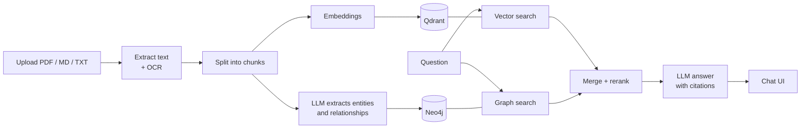

# Hybrid GraphRAG — Qdrant + Neo4j

Ask questions about your documents and get answers **with citations**.
Each document is stored two ways — as **vectors in Qdrant** (for semantic search) and as a **knowledge graph in
Neo4j** (people, companies, places and how they are connected). Every question searches both, and an LLM writes the
answer from the combined evidence.

- **Documents:** PDF (including scanned pages and text in images, via OCR), Markdown, text — in **any language**
  (tested with English, Hindi, Hinglish)
- **Answers** cite text excerpts as `[C1]` and graph facts as `[G1]`; answers come in the question's language
- **Hybrid beats either alone** on multi-step questions ("Who leads the company whose supplier was put on
  probation?"), counting ("Which vendor supplies the most subsidiaries?") and cross-language questions
- **LLM of your choice:** OpenAI, Google Gemini, or a free local model with Ollama — switchable in the UI
- Runs entirely in **Docker**: Qdrant, Neo4j, a FastAPI backend and a Streamlit chat UI

---

## How it works



```
Upload ─► text + OCR ─► chunks ─┬─► embeddings ─────────► Qdrant  (vectors)
                                └─► LLM: entities + links ─► Neo4j  (graph)

Question ─┬─► vector search (Qdrant) ─┐
          └─► graph search  (Neo4j)  ─┴─► merge + rerank ─► LLM ─► answer with [C#] / [G#] citations
```

Vector search finds text that *looks like* the question. The graph follows *connections* — across documents and
languages — that plain similarity search can't. Using both gives the best answers (see [Results](#results)).

---

## Run it locally

### 1. Install

- **Docker** with Docker Compose — [Docker Desktop](https://www.docker.com/products/docker-desktop/) on Windows /
  macOS (Windows: use the WSL 2 backend), or Docker Engine on Linux. Give Docker **at least 8 GB of RAM**.
- **git**. `make` is optional — every command below also has a plain `docker compose` version.
- About **8 GB of free disk space**.

### 2. Clone and configure

```bash
git clone https://github.com/thepratyushranjan/hybrid-graphrag.git
cd hybrid-graphrag
cp .env.example .env          # Windows PowerShell: copy .env.example .env
```

Open `.env` and set two things:

1. **`NEO4J_PASSWORD`** — any password with 8+ characters (set it before the first start).
2. **An LLM** — pick one:

| Option | Put this in `.env` | Notes |
|---|---|---|
| **OpenAI** (default) | `LLM_PROVIDER=openai`<br/>`LLM_MODEL=gpt-4o-mini`<br/>`OPENAI_API_KEY=sk-...` | Simplest; small API cost |
| **Ollama** (free, local) | `LLM_PROVIDER=ollama`<br/>`LLM_MODEL=gemma4:latest`<br/>`LLM_REASONING_EFFORT=none`<br/>`ANSWER_REASONING_EFFORT=low`<br/>`EXTRACTION_REASONING_EFFORT=low` | Install [Ollama](https://ollama.com), run `ollama pull gemma4`. Needs a GPU with ~8 GB+ VRAM. Data never leaves your machine |
| **Gemini** | `LLM_PROVIDER=gemini`<br/>`LLM_MODEL=gemini-2.5-flash`<br/>`GEMINI_API_KEY=...` | Free tier available |

Everything else in `.env` already has working defaults.

### 3. Start

```bash
docker compose up -d
```

The first start builds the image and downloads ~2 GB (PyTorch, the embedding and reranker models, OCR) — this takes
several minutes once; later starts take seconds. Check that everything is up:

```bash
curl http://localhost:8000/health
# ... "checks": {"qdrant": "ok", "neo4j": "ok", "llm": "ok"}
```

### 4. Load the sample documents (optional)

```bash
make seed                     # or: docker compose exec api python scripts/seed.py
```

This loads the two sample documents from `data/samples/` (a few minutes with a local model). You can skip it and
upload your own files from the UI instead.

### 5. Open the app

| | URL |
|---|---|
| **Chat UI** | http://localhost:8501 |
| API docs (Swagger) | http://localhost:8000/docs |
| Neo4j Browser | http://localhost:7474 (user `neo4j`, your `NEO4J_PASSWORD`) |
| Qdrant dashboard | http://localhost:6333/dashboard |

---

## Using it

**In the chat UI:** upload documents in the sidebar (progress is shown while they are processed), then ask
questions. Each answer shows clickable citations, the source excerpts (with links to the original file), the graph
relationships used, an interactive graph view, and timings. In the sidebar you can switch the **mode** — `hybrid`,
`vector` or `graph` — to compare them on the same question, and choose the **answer model**.

**Example questions** (with the sample documents loaded):

| Question | Expected answer |
|---|---|
| Which vendors connected to Ganga Smart Power are impacted by Clause 7.2? | DataSecure Cloud and NovaGrid Electronics |
| Who leads the subsidiary whose steel supplier was put on probation? | Vikram Singh — try it in `vector` mode too: vector search alone can't answer it |
| Which vendor supplies the most Ganga subsidiaries? | Brightline Logistics (2) |
| गंगा स्मार्ट पावर के विक्रेताओं पर कौन सी धारा लागू होती है? | Clause 7.2 — answered in Hindi |
| In the compliance bulletin, what happened to Shakti Steel Works in October 2025? | Put on probation on 20 Oct 2025 after the 14 Oct incident (from the scanned page) |

**Useful commands**

| Task | With `make` | Without `make` |
|---|---|---|
| Start / rebuild | `make up` | `docker compose up -d --build` |
| Stop (keeps data) | `make down` | `docker compose down` |
| Load sample documents | `make seed` | `docker compose exec api python scripts/seed.py` |
| Compare vector / graph / hybrid | `make compare q="your question"` | `docker compose exec api python scripts/compare_modes.py "your question"` |
| Run tests | `make test` | see `Makefile` |
| Ragas evaluation | `make eval` | `docker compose exec api python eval/run_ragas.py` |
| View logs | `make logs` | `docker compose logs -f api ui` |
| Apply `.env` changes | — | `docker compose up -d --force-recreate api ui` |
| **Delete all data** | `make reset` | `docker compose down -v` |

**API:** `POST /ingest` (upload a file), `GET /ingest/{job_id}` (progress), `POST /query` (ask; returns the answer,
citations, chunks, graph facts and a subgraph), `GET /health`, `GET /stats` — full reference at
http://localhost:8000/docs.

---

## Results

[Ragas](https://docs.ragas.io) evaluation: 8 questions (lookup, multi-hop, counting; English, Hindi, Hinglish) in
[`eval/testset.json`](eval/testset.json), each answered in all three modes. Judge: local `gemma4` via Ollama.
Re-run with `make eval`; full output in [`eval/results/latest.md`](eval/results/latest.md).

| Mode | Faithfulness | Answer relevancy | Context precision | Factual correctness | Context recall | Answered |
|---|---|---|---|---|---|---|
| vector | 1.000 | 0.945 | 0.865 | 0.738 | 0.875 | 8/8 |
| graph | 0.945 | 0.896 | 0.559 | 0.615 | 0.750 | 6/8 |
| **hybrid** | 0.938 | 0.925 | 0.702 | 0.610 | **1.000** | 8/8 |

What this shows:

- **Hybrid is the only mode that found the evidence for every question** (context recall 1.000). On the multi-hop
  question *"Who leads the subsidiary whose steel supplier was put on probation?"* vector search scores 0.00 recall and
  graph search 0.00, while hybrid scores 1.00 and answers it.
- **Vector-only does well on simple lookups**, which are most of this small test set — that is why its averages are high.
- **Graph-only can't answer free-text questions** (e.g. revenue figures that aren't relationships) — 6/8 answered.
- **Hybrid has lower context precision** because it adds graph facts alongside the text, and the judge ranks some of
  those as less useful.
- **Factual correctness is noisy with a small local judge.** It compares claims against a short reference answer, so a
  longer answer with extra true details is penalised. Example: hybrid's q4 answer is correct (Brightline Logistics,
  two subsidiaries) but scored 0.00 because it also listed the other vendors.

With 8 questions and a local judge, small differences are not significant. The project also has **138 automated tests**
(`make test`).

---

## Design choices

| Choice | Why |
|---|---|
| **Two stores** — Qdrant for text, Neo4j for relationships | Vector search can't follow chains of facts or count; the graph can. Results are merged with Reciprocal Rank Fusion and reranked |
| **Multilingual models** (`multilingual-e5-small` embeddings, `mmarco` cross-encoder reranker) | Run locally on CPU and handle Hindi and English in the same index |
| **LLM-extracted graph with an evidence check** | Works for any document type; a fact is kept only if its supporting quote really appears in the text, which filters out made-up facts |
| **Fixed list of relation types** (`LEADS`, `SUPPLIES`, `IMPACTS`, …) | Keeps the graph consistent and easy to query |
| **One node per real-world entity**, across languages | "शक्ति स्टील वर्क्स" and "Shakti Steel Works" become the same node |
| **Graph → vector bridge** | Graph facts bring in the text chunks that support them, even when vector search ranked them low |
| **Citations are checked** | Citations that don't exist in the evidence are removed; with no relevant evidence the system says so instead of guessing |
| **Any OpenAI-compatible LLM** | OpenAI, Gemini or local Ollama through one client; chosen per question in the UI |

More detail — data quality handling, graph schema, how retrieval works step by step, configuration, limitations —
is in **[docs/DESIGN.md](docs/DESIGN.md)**.

---

## Project structure

```
├── docker-compose.yml     Qdrant, Neo4j, API, UI
├── Dockerfile             Python 3.11 image (OCR + models included)
├── .env.example           all settings, with defaults
├── Makefile               shortcuts (up, seed, test, eval, ...)
├── data/samples/          two sample documents (English + Hindi, one scanned PDF)
├── src/graphrag/          the application
│   ├── ingestion/         reading files, OCR, chunking
│   ├── graph/             Neo4j + entity/relationship extraction
│   ├── vector_store/      Qdrant
│   ├── retrieval/         hybrid search, fusion, reranking
│   ├── generation/        prompts, answers, citation checks
│   └── api/               FastAPI endpoints
├── ui/                    Streamlit chat app
├── scripts/               seed, compare modes, search, model download
├── eval/                  Ragas test set and evaluation
├── tests/                 unit + integration tests
└── docs/                  DESIGN.md (details), LOOM_SCRIPT.md (demo)
```

---

## Troubleshooting

| Problem | Fix |
|---|---|
| `port is already allocated` | Something else uses port 8000, 8501, 7474, 7687 or 6333 — stop it, or change `API_PORT` / `UI_PORT` in `.env` |
| `/health` shows `llm: error: no OPENAI_API_KEY` | Add the key to `.env`, then `docker compose up -d --force-recreate api` |
| Ollama not reachable (Linux with Docker Engine) | Ollama only listens on localhost by default: `sudo systemctl edit ollama`, add `[Service]` and `Environment="OLLAMA_HOST=0.0.0.0"`, then `sudo systemctl restart ollama` |
| Neo4j stays *unhealthy* after changing `NEO4J_PASSWORD` | The password is fixed at first start: `make reset && make up` (deletes the data) |
| Upload says "graph skipped" | The LLM wasn't reachable — fix `.env`, recreate the API, upload again |
| Containers stop during upload | Docker ran out of memory — give it more RAM (≥ 8 GB) |
