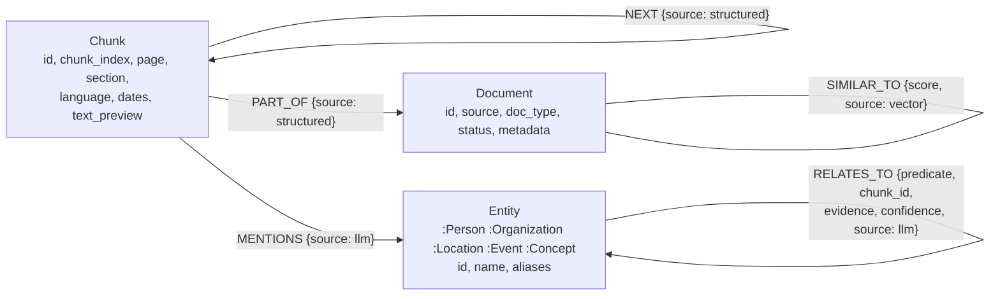

# Design and implementation details

Everything behind the short [README](../README.md): data, graph schema, how hybrid retrieval works, design trade-offs, real outputs, configuration, scripts, limitations and future work.

**Contents:** [Data](#data) · [Knowledge graph schema](#knowledge-graph-schema) · [How hybrid retrieval works](#how-hybrid-retrieval-works) · [Design trade-offs](#design-trade-offs) · [Sample queries (real outputs)](#sample-queries-real-outputs) · [Configuration](#configuration) · [Known limitations](#known-limitations) · [Future work](#future-work) · [Scripts](#scripts)

---

## Data

Two **fictional** sample documents in `data/samples/`, written to exercise every part of the pipeline:

| File | Content | What it tests |
|---|---|---|
| `ganga_infra_annual_report_2025.md` | Annual report of an infrastructure group: 3 subsidiaries, executives, 5 vendors, projects, risks. One section in **Hindi** | Markdown sections, Hindi text, entities and relations across languages |
| `vendor_compliance_bulletin_q3_2025.pdf` | Compliance clauses (7.2 data residency, 9.1 safety certificates, 11.4 chemicals) and which vendors they impact | Page 1: text + an **image of Hindi text**; page 2: a fully **scanned page** (no text layer, English + Hindi); page 3: text |

Facts are deliberately spread over both files (vendor → subsidiary in the report, clause → vendor in the bulletin,
probation in the scanned annex, managing directors in the report), so several questions need **multi-hop,
cross-document** answers. `scripts/make_sample_pdf.py` regenerates the PDF.

**Data-quality issues handled**

| Issue | Handling |
|---|---|
| Scanned pages / text inside images | Page with < 50 chars of text → rendered at 300 DPI and OCR'd; embedded images ≥ 100 px OCR'd, logos deduplicated by hash. OpenCV denoise + Otsu threshold + **deskew**; words below 60 % confidence dropped (sample: 93–95 % mean confidence) |
| Legacy Hindi fonts (Kruti Dev…) whose text layer is Latin gibberish | Detected by font name → page OCR'd instead |
| PDF ligatures ("Office"), zero-width characters, mixed whitespace | NFC normalisation, ligature expansion, zero-width removal (ZWJ/ZWNJ kept for Indic scripts) |
| Same entity in two languages / spellings / with "Pvt Ltd" | Canonical English name + as-written aliases; IDs strip company suffixes; resolver merges by name *and* alias → one node |
| LLM hallucinated facts | A triple is kept only if its **evidence quote appears verbatim in the chunk**, confidence ≥ 0.5, and both ends are real entities |
| Implicit subjects (CV bullets, "Skills: Python, SQL") | Extraction gets the document's opening lines as context and attributes such lines to the document's main subject |
| Dates written many ways (14/10/2025, Q3 2025, अक्टूबर 2025) | Parsed per chunk into a date span (datetime payload indexes) for time filters |

**Privacy:** the sample documents are fictional — no real people or companies. Uploaded originals are stored in
`data/uploads/` only so citations can link to them; that folder, `.env` and all database volumes are git-ignored.
Everything runs locally except calls to the LLM provider you configure (choose Ollama to keep all data on your machine).

## Knowledge graph schema

- **Predicates** (always English, even for Hindi text): `WORKS_FOR LEADS SUBSIDIARY_OF OWNS SUPPLIES CONTRACTED_BY
  SUBCONTRACTS_TO PARTNER_OF LOCATED_IN IMPACTS PARTICIPATED_IN CAUSED OCCURRED_AT MEMBER_OF PRODUCES HAS_SKILL USES
  STUDIED_AT RELATED_TO`. Anything else becomes `RELATED_TO` with the original phrase kept.
- One `RELATES_TO` edge per (predicate, evidence chunk): every fact points at the chunk that proves it.
- **Constraints / indexes:** unique `id` on Document, Chunk, Entity; indexes on `Chunk.source`, `Entity.type`,
  `RELATES_TO.predicate`, `RELATES_TO.chunk_id`; full-text index `entity_names` over names + aliases
  (`standard-folding` analyzer: Unicode word splitting works for Devanagari).
- Writes are `UNWIND … MERGE` on `id` only, then `SET` — re-ingesting a file gives **identical node and edge counts**
  (tested); an edited file replaces its old chunks, relations and orphaned entities in one transaction.

**Qdrant collection `knowledge_vectors`:** cosine distance, 384 dims, HNSW `m=16, ef_construct=100`; point ID =
UUID5 of the chunk ID; payload `doc_id, chunk_id, source, doc_type, page, section, text, language, dates,
date_start, date_end, extraction_method, ocr_confidence, metadata`; **payload indexes** on `doc_id, chunk_id, source,
doc_type, language, extraction_method` (keyword), `page` (integer), `date_start, date_end` (datetime).

## How hybrid retrieval works

1. **Query analysis** (LLM, structured output): named entities → resolved to graph nodes through the full-text
   index (exact name/alias first; an ambiguous partial name like "Ganga" is *not* resolved), query type (lookup /
   relationship / aggregation), the relation asked about, and payload filters — a document or file type named in
   the question, and a **time range** parsed deterministically ("since April 2026", "पिछले 3 दिन"). A filter that
   would match nothing is dropped and reported instead of hiding every result.
2. **Parallel retrieval:** the vector search starts immediately while the (slow) LLM analysis runs; the graph
   branch runs its **Cypher templates** — entity neighbourhood (1-hop), 2-hop expansion, shortest paths between
   query entities (≤ 3 hops), intersection (things linked to *all* query entities), directed aggregation (counts /
   rankings) — skipping hub nodes (> 50 edges) and always `LIMIT`ed. If the question names no entity, hybrid mode
   **seeds the graph walk from the entities in the top vector chunks**.
3. **Graph→vector bridge:** the chunks that support the graph facts are fetched from Qdrant by ID — the graph brings
   in text that vector search ranked too low or missed.
4. **Fusion:** Reciprocal Rank Fusion of the vector list and the graph-linked list, + a boost per query entity a
   chunk mentions; the **multilingual cross-encoder** reranks the top 20 chunks *and* scores the graph facts.
   Facts with the relation the question asks about are boosted — more when they share an entity with the most
   relevant facts, which completes 2-hop chains. Everything is fitted into a 3 000-token budget.
5. **Grounded answer:** the prompt holds `[C#]` excerpts (doc, page, section, dates) and `[G#]` typed facts
   (`(Person: Vikram Singh) -[LEADS]-> (Organization: Ganga Roadways)`, source, confidence, evidence quote).
   The validator removes citations that weren't in the prompt, flags uncited sentences and retries once if an answer
   cites nothing. No relevant evidence → "not found" without calling the LLM; greetings are answered without search.

## Design trade-offs

| Decision | Chosen | Why / alternative |
|---|---|---|
| Embedding model | `multilingual-e5-small` (384-d, local) | Free, offline, 94 languages, small enough for CPU. `bge-small-en` is English-only; OpenAI `text-embedding-3-small` (1536-d) is supported via config but needs a key |
| Reranker | `mmarco-mMiniLMv2-L12-H384` cross-encoder | Multilingual (incl. Hindi); also reused to score graph facts, which embedding cosine ranked badly (all ≈ 0.8) |
| Graph construction | LLM triples with an evidence-quote check | Generic for any document. The check makes hallucinated triples cheap to reject (they never quote the text); cost: some true facts are dropped |
| Predicate set | Fixed whitelist + `RELATED_TO` fallback | Keeps the graph queryable (templates can rely on `LEADS`, `SUPPLIES`…); free-text predicates would fragment it |
| Entity resolution | Canonical English names + aliases, deterministic IDs | One node per real entity across languages; simpler and more predictable than embedding-based clustering |
| LLM provider | OpenAI / Gemini / Ollama through one OpenAI-compatible client | Swap by config; pick per question in the UI. Local Ollama keeps data on the machine |
| Retrieval modes | `vector` / `graph` / `hybrid` switch on every request | Makes the contribution of each branch visible and measurable (UI, `make compare`, Ragas ablation) |
| Fusion | RRF + rerank, not score averaging | Vector and graph scores aren't comparable; ranks are |
| Filters | Inferred filters verified and dropped if empty; explicit API filters never dropped | A wrong inferred filter would silently hide the answer |
| Time ranges | Deterministic parser, not the LLM | Exact, testable, works without an LLM; relative ranges use today's date |
| Ingestion | Background job, one worker | LLM extraction is slow; one-at-a-time protects a local GPU and API rate limits |
| Idempotency | Deterministic chunk IDs, MERGE on id, on-disk LLM cache | Re-ingesting never duplicates data and never re-pays for the LLM |

## Sample queries (real outputs)

Captured from the running system with `gemma4` (Ollama) as the LLM; full JSON in `docs/sample_outputs.json`.
`make compare q="..."` shows the three modes side by side for any question.

**1. Multi-hop across both documents — only hybrid answers it**

> **Who leads the subsidiary whose steel supplier was put on probation?**

| Mode | Answer |
|---|---|
| vector | "The evidence does not state who leads the subsidiary whose steel supplier was put on probation." (it finds the probation, not the Managing Director) |
| graph | "Graph mode … needs a named entity that exists in the graph … None was found in your question." |
| **hybrid** | "**Vikram Singh** leads Ganga Roadways Pvt Ltd, which was the entity that placed Shakti Steel Works on probation [G2][G3]." |

Hybrid seeded the graph walk from the entities in the top chunks (Ganga Roadways, Shakti Steel Works…), found
`(Person: Vikram Singh) -[LEADS]-> (Organization: Ganga Roadways)` in the *annual report* and joined it to the
probation in the *scanned page* of the bulletin; all 4 excerpts were found by **vector + graph**.

**2. Relationship question with two named entities**

> **Which vendors connected to Ganga Smart Power are impacted by Clause 7.2?**

"The vendors connected to Ganga Smart Power that are impacted by Clause 7.2 are **DataSecure Cloud Pvt Ltd and
NovaGrid Electronics** [C1][C2]." — templates `neighbourhood, two_hop, path, intersection`; 3 of 4 excerpts found
by vector + graph.

**3. Aggregation** — *Which vendor supplies the most Ganga subsidiaries?* → "**Brightline Logistics** … supplying
both Ganga Roadways Pvt Ltd and Ganga Water Systems Ltd [C1][G3][G4]." The graph adds a Counts table (directed
`SUPPLIES` edges; Brightline 2).

**4. Hindi question, cross-language evidence** — *गंगा स्मार्ट पावर के विक्रेताओं पर कौन सी धारा लागू होती है?* →
"गंगा स्मार्ट पावर के विक्रेताओं पर **धारा 7.2 — ग्राहक डेटा निवास** (Customer Data Residency) लागू होती है [C2][G11]। …
यह धारा DataSecure Cloud Pvt Ltd और NovaGrid Electronics दोनों को प्रभावित करती है …" (answered in Hindi from English
excerpts and graph facts).

**5. Document + time filters** — *In the compliance bulletin, what happened to Shakti Steel Works in October 2025?* →
filter `source=vendor_compliance_bulletin_q3_2025.pdf`, time `October 2025` → "Shakti Steel Works was placed on
probation by Ganga Roadways Pvt Ltd starting October 20, 2025 [C1][G1]. … On October 14, 2025, two workers were
injured … [C1][G2]. The consignment … did not have a safety certificate [C1][G3]." (C1 is the **OCR'd scanned page**.)

**6. No evidence** — *What is the capital of France?* → "I could not find information about this in the knowledge
base." (no LLM call, 0.2 s).

Typical latency with a local `gemma4` on an RTX 4070: retrieval 0.2–0.8 s (embedding, Qdrant, Cypher, reranking),
answer generation 5–10 s.

## Configuration

All settings are environment variables (`.env`, see `.env.example` for every option). The main ones:

| Variable | Default | Meaning |
|---|---|---|
| `LLM_PROVIDER` / `LLM_MODEL` | `openai` / `gpt-4o-mini` | Default LLM: builds the graph at ingest, answers when no provider is picked |
| `OLLAMA_MODEL` / `OPENAI_MODEL` / `GEMINI_MODEL` | `gemma4:latest` / `gpt-4o-mini` / `gemini-2.5-flash` | Model per provider (pickable per question) |
| `OPENAI_API_KEY` / `GEMINI_API_KEY` / `OLLAMA_BASE_URL` | — | Provider credentials / endpoint |
| `*_REASONING_EFFORT` | empty | `none`/`low`… for local thinking models (query analysis / answer / extraction); leave empty for gpt-4o-mini |
| `EMBEDDING_PROVIDER` / `EMBEDDING_MODEL` / `EMBEDDING_DIM` | `huggingface` / `intfloat/multilingual-e5-small` / 384 | Embeddings (OpenAI supported) |
| `CHUNK_SIZE` / `CHUNK_OVERLAP` | 500 / 50 | Tokens, measured with the embedding model's tokenizer |
| `OCR_ENABLED` / `OCR_LANGUAGES` / `OCR_MIN_CONFIDENCE` | `true` / `eng+hin` / 60 | OCR (add Tesseract language packs via the `OCR_LANG_PACKS` build arg) |
| `VISION_CAPTIONS_ENABLED` | `false` | Describe images without text (charts, photos) with a vision LLM |
| `TOP_K` / `GRAPH_HOPS` / `MAX_FACTS` / `RERANK_ENABLED` | 4 / 2 / 20 / `true` | Excerpts and facts sent to the LLM, graph depth, reranking |
| `SIMILAR_DOCS_MIN_SCORE` | 0.90 | `SIMILAR_TO` threshold (e5: related docs ≈ 0.93, unrelated ≈ 0.87) |
| `MIN_EVIDENCE_SCORE` | 0.05 | Below this relevance for everything, answer "not found" without the LLM |

## Known limitations

- **Extraction quality depends on the LLM.** With a local 8B model (`gemma4`), some true facts are missed or dropped
  by the evidence check, and a few low-value relations get through (e.g. `RELATED_TO` noise); facts written the
  wrong way round are re-oriented by entity type, but not every error is caught. `gpt-4o-mini` extracts more
  consistently.
- **Answers can vary slightly between runs** of a local model, even at temperature 0, and a local model sometimes
  phrases citations as "[C1] states that…". The validator still guarantees that every citation exists.
- **Aggregation counts** reflect the graph: an entity linked to a project as well as to a company counts both.
- **Dates are coarse:** a year mention covers the whole year; relative ranges are rolling windows; undated chunks
  are excluded while a time filter is active (the filter is dropped if nothing matches).
- **OCR** needs the Tesseract language pack for each script (eng + hin built in); confidence filtering can drop a
  rare word.
- Ingestion jobs are kept in memory (history is lost on restart; the data isn't).
- Ragas scores with a local 8B judge are noisy in absolute terms — compare modes with them, not other systems.

## Future work

- Community / summary nodes (GraphRAG "global search") for questions about a whole corpus.
- Entity resolution with embeddings + LLM verification for near-duplicate names the rules don't catch.
- Streaming answers (SSE) and conversation memory for follow-up questions.
- Persistent job store (Redis/Postgres) and parallel ingestion workers for cloud LLMs.
- Graph-aware reranking trained on the evaluation set; a larger Ragas test set.
- Authentication and per-user document collections.

---

**Demo video:** see `docs/LOOM_SCRIPT.md` for the 2–3 minute walkthrough script.

## Scripts

Small command-line tools around the main service. They run **inside the API container**, so they use the same
configuration (`.env`) and databases as the app.

| Script | What it's for | When to use it | Run with |
|---|---|---|---|
| `download_models.py` | Downloads the embedding model and the reranker and stores them in the Docker image | Automatically, during `docker compose build` / `up` (the `Dockerfile` calls it). **Required** — don't run it by hand | — |
| `seed.py` | Ingests every PDF / Markdown / text file in `data/samples/` into Qdrant + Neo4j (same pipeline as `POST /ingest`). Idempotent: running it again changes nothing | After the first start, to load the demo documents; again after changing the LLM, to rebuild the graph | `make seed` · `docker compose exec api python scripts/seed.py` |
| `compare_modes.py` | Runs the same question(s) in **vector-only, graph-only and hybrid** mode and prints, side by side, the excerpts, graph facts, counts, entities and filters each mode found | To see (or show a reviewer) what the graph adds over plain vector search; with no question it runs 5 demo questions | `make compare` · `make compare q="Who leads Ganga Roadways?"` |
| `search.py` | Plain vector search in Qdrant (no graph, no LLM), with optional `--language`, `--doc-type`, `--source` filters | To check what was indexed, or debug why a chunk is or isn't found | `make search q="data residency" args="--doc-type pdf"` |
| `make_sample_pdf.py` | Generates `data/samples/vendor_compliance_bulletin_q3_2025.pdf`: a text page with an **image of Hindi text** and a fully **scanned page** (no text layer), to exercise OCR | Only to rebuild or change the sample PDF (needs Noto fonts; the command is in the file's docstring) | see the script |

The Ragas evaluation lives in `eval/` (`make eval`, see [Evaluation](../README.md#results)).

---

